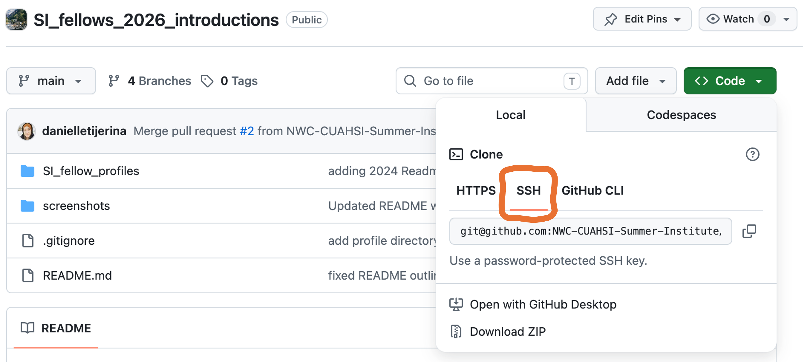

# Summer Institute 2026 - GitHub Training

#### Description

This is a training repository for introducing basic git collaboration workflows.

Welcome to the National Water Center Innovators Program Summer Institute GitHub training repository! 🙌  
This repository is designed to help participants of the Summer Institute get comfortable with using GitHub, a tool for collaborative software development and data science.

#### Training Objective

The goal of this training is to familiarize you with the basics of GitHub. You will learn how to clone a repository, make edits, and commit changes. This exercise is intended to prepare you for contributing to collaborative projects during the Summer Institute, ensuring that all code and findings are public and reproducible.

# GitHub Training Workflow

## 0. Prerequisites

- You probably already have a GitHub account, but in case you don’t, you can sign up [here](https://github.com).

- We will be using the CIROH 2i2c cloud compute platform during the Summer Institute bootcamp. You can access that platform here: https://ciroh.awi.2i2c.cloud/. Log in using your GitHub username.

> 💡 If you do not have a 2i2c account:
>
> 1.  Visit the [CIROH Hub Infrastructure Access website](https://docs.ciroh.org/docs/services/access/).
> 2.  Click on "Cloud Infrastructure Request Form” under “CIROH-2i2c JupyterHub”.

## 1. Log into CIROH AWI 2i2c JupyterHub

For the Summer Institute bootcamp, we’ll use the 2i2c AWI JupyterHub cloud computing platform hosted by The Alabama Water Institute. The administrators have already set this up for you, so should already have access to this platform.

1a. Go to https://ciroh.awi.2i2c.cloud/hub/login and **log in with your GitHub username**.

1b. **Choose Server Option** – Small machine with image: “New Pangeo Notebook base image 2024.04.08” and click the _Start_ button at the bottom of the page. It might take a minute or two to start up. When it starts, it will open up a bash terminal on the right, and a file explorer on the left.  
 

> 💡 _**Quick Trick in the JupyterHub**_
>
> 1.  Click on "View" and toggle on "Show hidden files"  
>     

## 2. Generating an SSH Key for Interacting with GitHub

The first thing we need to do is to set up our SSH Key to make changes to our _remote_ GitHub Repo.

#### 2a. Open a Terminal Window:

Once you launch the 2i2c JupyterHub, if a terminal windown isn't already open, open the _Launcher_ by clicking the <span style="color:#0F52BA">blue rectangle with a "+" sign</span>. There you can select _Terminal_. The following commands should be entered into this terminal.

#### 2b. Configure Git:

First, tell Git who you are. Replace the examples below with your own information.  
❗ _The email used should be the one associated with GitHub_

```
git config --global user.name "Your Name"
git config --global user.email "your_email@example.com"
```

Verify your settings:

```
git config --global --list
```

You should see something similar to:

`user.name=Your Name`  
`user.email=your_email@example.com`

#### 2c. Create an SSH Key

SSH keys allow GitHub to recognize your JupyterHub environment securely. To generate a new SSH key, run the following in the Terminal:

```
ssh-keygen -t ed25519 -C "your_email@example.com"
```

When prompted to "`Enter file in which to save the key`", press _**Enter**_ to accept the default location, which in the JupyterHub is `/home/jovyan/.ssh/id_ed25519`

When prompted to "`Enter passphrase (empty for no passphrase)`":

- Press Enter to leave it blank (this is fine for this workshop), OR
- Create a passphrase for additional security

You should see output similar to:

```
Your identification has been saved in /home/jovyan/.ssh/id_ed25519

Your public key has been saved in /home/jovyan/.ssh/id_ed25519.pub
```

## 3. Create a new SSH Authentication Key on Github

#### 3a. Copy your SSH key from 2i2c JupyterHub:

    Before heading over to https://www.github.com, you'll need to copy your SSH key. Print your public key by running:

```
cat /home/jovyan/.ssh/id_ed25519.pub
```

The output will look something like:

`ssh-ed25519 AAAAC3NzaC1lZDI1NTE5AAAAI... your_email@example.com`

Copy the entire line to your clipboard, making sure to copy everything beginning with `ssh-ed25519` and ending with your email address.

#### 3b. Add the SSH Key to Github:

Open GitHub on your web browser and do the following:

- sign in to [GitHub](https://www.github.com)
- click your profile picture (upper right)
- select _Settings_
- in the left sidebar, select _SSH and GPG keys_ (left side menu)
- click _New SSH key_ button

This will take you to the _**Add new SSH Key**_ form:


In the SSH Key form, edit the:

- _Title_ - fill in a descriptive title (e.g., "CIROH JupyterHub")
- _Key Type_ - leave the key type as "Authentication Key"
- _Key_ - Paste your SSH key you copied from the 2i2c terminal.

Click the _Add SSH Key_ button and you're set! GitHub may ask you to confirm your password or complete two-factor authentication.

## 4. Clone the Repository

#### 4a. Copy the SSH Repo Link

Go to the GitHub site for our repository: `NWC-CUAHSI-Summer-Institute/SI_fellows_2026_introductions`, and click on the green button and copy the **SSH** address.  
❗ _Because you set up an SSH key on 2i2c, you must use the repository's SSH URL instead of the HTTPS URL to successfully clone!_



#### 4b. In Jupyter environment, type:

```
git clone git@github.com:NWC-CUAHSI-Summer-Institute/SI_fellows_2026_introductions.git
```

Change directories into the _SI_fellows_2026_introductions_ directory:

```
cd SI_fellows_2026_introductions
```

## 5. Make a New Branch For Your Repository Contributions

> 💡 _FYI_ - Understand the difference between forks and branches: [Fork vs Branch](https://www.ssw.com.au/rules/fork-vs-branch/).

Create a new branch:

```
git branch [your_branch_name]
```

Checkout your branch (move from the `main` branch to `your_branch_name` branch)

```
git checkout [your_branch_name]
```

List all of the branches, for fun (and to see that your new branch is not a remote branch):

```
git branch -a
```

Set the upstream and push your local branch to remote (you only need to do this one time):

```
git push --set-upstream origin [your_branch_name]
```

> 💡 _**Note**_: As of now, your branch only exists _**locally**_ (on your computer or in your personal 2i2c JupyterHub workspace).
>
> - `--set-upstream` flag links a _**local branch**_ to a _**remote branch**_ so you can run `git push` and `git pull` without specifying the remote name or branch tracking targets every time.
> - `origin` is just the default name Git gives to the URL of the remote repository you cloned.

> The Arctic Data Center provides a great [resource on collaborating with Git and information about remote repositories](https://learning.nceas.ucsb.edu/2025-02-arctic/session_08.html).

## 6. Make a New Text File and Add Your Information to it

Copy the `introductions.txt` file in Jupyter Lab:

```
cd SI_fellow_profiles

cp introductions.txt <yourName_profile.txt>
```

Open the new file, add a few notes about yourself, and save the file.

## 7. Commit Your Changes

Before we make a commit, let's check out what the status of our repository is:

```
git status
```

> 💡 _**Note**_: You'll likely see that the file you just created is <span style="color: red;">red</span>! This means the file is **untracked (or unstaged)**, which means you have created the file in your working directory, but Git is not actively monitoring its changes.

Stage and commit your changes:

```
git add <yourName_profile.txt>

git status #your file should show up as green now!

git commit -m "Added my profile file"
```

## 8. Push Your Changes

Push your branch to the remote repository:

```
git push
```

> 💡 _**Note**_: because we already linked your local repository to the remote repository (`--set-upstream`), you can just run `git push` and it will push to the remote.

## 9. Create a Pull Request

A [Pull Request (a.k.a "a PR")](https://docs.github.com/en/pull-requests/collaborating-with-pull-requests/proposing-changes-to-your-work-with-pull-requests/about-pull-requests) is a propsal to merge your code changes into an existing project and is a foundational GitHub **collaboration feature**. Here, we will create a pull request to merge your code from your branch into the main branch.

Go to the [GitHub repository website](https://github.com/NWC-CUAHSI-Summer-Institute/SI_fellows_2026_introductions).

Click the “Compare & pull request” button.  
 

Fill in the pull request title and description with specific details and submit.  
 

By following these steps, you’ll contribute your changes to the repository and learn the basics of GitHub workflows.
